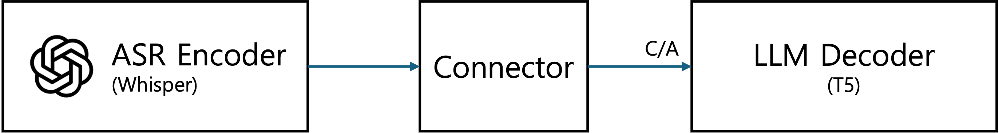
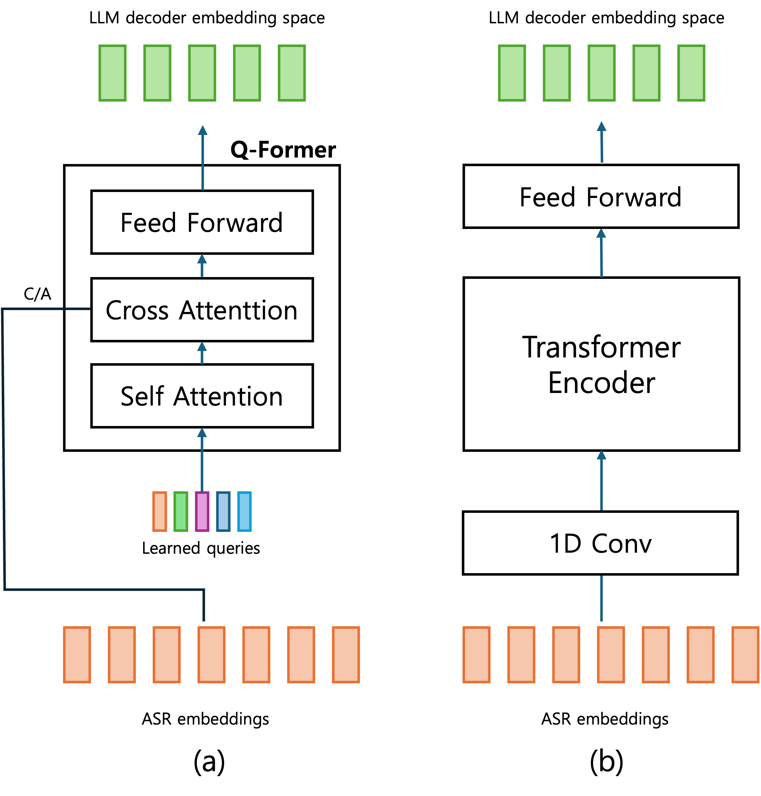

# Jeju Dialect Speech-to-Text Translation

An end-to-end speech translation study that converts spoken Jeju dialect directly into standard Korean text by connecting a pretrained Whisper encoder to a T5 decoder through lightweight trainable connector modules.

> This project was conducted in Spring 2025 as part of [AIKU](https://github.com/AIKU-Official), an artificial intelligence student organization at Korea University. The team repository is available at [AIKU-Official/aiku-25-1-jejudialect2standard](https://github.com/AIKU-Official/aiku-25-1-jejudialect2standard).

## Research Motivation

Modern automatic speech recognition systems are typically optimized for standard-language speech and often perform poorly on underrepresented regional varieties. Jeju dialect is both culturally significant and critically endangered, yet its lexical, grammatical, and phonological differences from standard Korean make direct transcription particularly challenging.

This project investigates whether a modular encoder–connector–decoder architecture can translate Jeju speech directly into standard Korean text. Rather than treating the task as conventional transcription, we combine a pretrained speech encoder with a pretrained text decoder and study how different connector designs bridge their representation spaces.

## My Contributions

**Douyoung Kwon ([douyoung89](https://github.com/douyoung89)) — Project Lead**

- Led the project and coordinated the overall research direction.
- Implemented the distributed training and evaluation pipeline for the Whisper–Connector–T5 architecture.
- Designed and conducted experiments across multiple connector configurations.
- Analyzed experimental results and co-authored the project paper.

The full project report is available in [Team8.pdf](./Team8.pdf).

## Model Architecture



The system follows an encoder–connector–decoder design inspired by prior work on integrating independently pretrained speech and language models.

### 1. Speech Encoder: Whisper

The Whisper encoder extracts acoustic representations from the input speech signal. Its pretrained parameters are frozen during connector training so that the original speech representation is preserved.

### 2. Trainable Connector

The connector maps Whisper's acoustic representation into an embedding sequence that the T5 decoder can process. We implemented and evaluated three connector architectures:

- **MLP:** a lightweight baseline composed of linear layers and nonlinear activations.
- **Q-Former:** a transformer-based module that uses a fixed number of learnable queries and cross-attention to summarize the variable-length speech sequence.
- **STE (Subsampler–Transformer Encoder):** a sequence-processing module that first reduces the temporal resolution with one-dimensional convolutions and then applies transformer encoder blocks.



### 3. Text Decoder: T5

The decoder generates standard Korean text from the connector output. We used the pretrained `paust/pko-t5-base` model and froze its parameters during connector training.

## Dataset

We used the [AI Hub Korean Dialect Speech Dataset — Jeju](https://aihub.or.kr/aihubdata/data/view.do?currMenu=115&topMenu=100&aihubDataSe=realm&dataSetSn=121), which pairs recordings of Jeju speech with standard Korean text.

Following the preprocessing procedure from [Jeju Translation](https://github.com/maeseok/Jeju_Translation.github.io), the audio and transcripts were converted into CSV manifests for training and evaluation. Due to computational constraints, approximately 70 GB of data was used for training, 13 GB for validation, and 5 GB for testing.

The dataset itself is not distributed in this repository.

## Training and Evaluation

The main training script supports PyTorch DistributedDataParallel for multi-GPU experiments:

```bash
python whisper_t5_ddp_connector.py \
  --train_csv /path/to/train.csv \
  --valid_csv /path/to/valid.csv \
  --test_csv /path/to/test.csv \
  --connector qformer
```

Available connector options are `mlp`, `qformer`, and `ste`. Additional arguments control the number of epochs, learning rate, warmup ratio, weight decay, batch size, and checkpoint directory.

Translation and transcription quality were evaluated using:

- **BLEU** for generated-text overlap;
- **WER** for word-level error;
- **CER** for character-level error; and
- **UMAP** visualizations for representation-space analysis.

## Results and Analysis

The connector-based models did not outperform a directly fine-tuned Whisper baseline. Across the MLP, Q-Former, and STE variants, BLEU remained close to zero.

UMAP analysis showed that the Whisper, connector, and T5 representations occupied clearly separated regions. This result indicates that the trainable connectors did not successfully align Whisper's acoustic–phonetic features with the syntactic–semantic representation expected by T5.

An additional decoder experiment produced better BLEU scores with an English T5 model than with the Korean T5 model. We attribute this result not simply to language compatibility, but to differences in pretraining strength and tokenization. In particular, the English model's byte-level tokenization may interact more effectively with the syllabic structure encoded by Whisper.

Although the proposed modular system underperformed the baseline, the negative result revealed an important limitation: independently pretrained speech and language models cannot necessarily be combined through a lightweight connector without explicit representation alignment.

## Repository Structure

| File | Description |
| --- | --- |
| `whisper_t5_ddp_connector.py` | Multi-GPU training and evaluation pipeline |
| `qformer.py` | Q-Former connector implementation |
| `ste.py` | Subsampler–Transformer Encoder implementation |
| `Team8.pdf` | Full project report |
| `architecture.png` | Overall model architecture |
| `connector.png` | Connector architecture diagram |

## Installation

The project was developed with Python 3.10 and PyTorch. Install the core dependencies with:

```bash
pip install torch torchaudio pandas transformers matplotlib seaborn jiwer
```

A CUDA-enabled environment is recommended for training.

## Team

| Member | Role |
| --- | --- |
| [Douyoung Kwon](https://github.com/douyoung89) | Project lead; training pipeline; experiments; paper writing |
| [Changyeop Lee](https://github.com/PROLCY) | Q-Former and STE implementation and experiments |
| [Yejin Hong](https://github.com/jinhong) | Baseline model and UMAP visualization implementation and experiments |

## Acknowledgments

This repository is a CV-oriented presentation of the collaborative AIKU project. Project provenance, team attribution, and the original implementation are preserved through the [official AIKU repository](https://github.com/AIKU-Official/aiku-25-1-jejudialect2standard).
